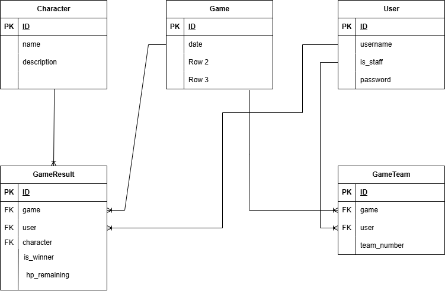
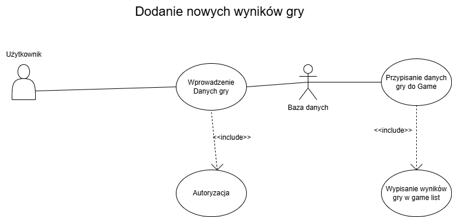
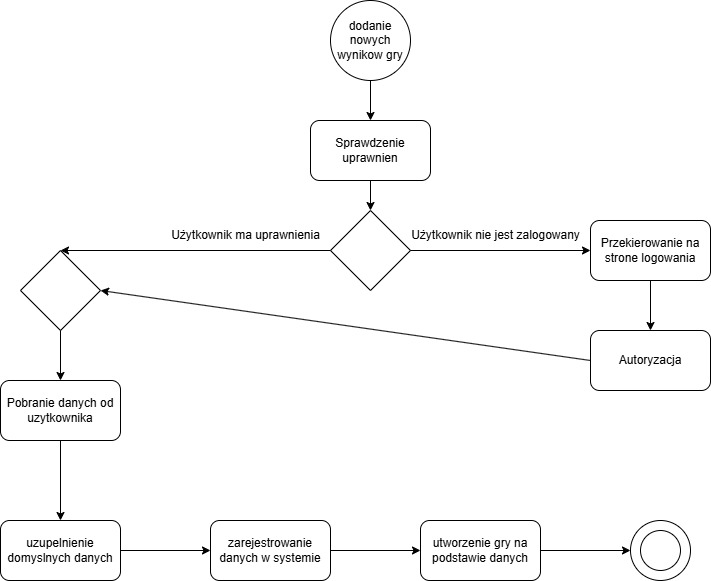

# Dice Throne Tracker

## [2 pkt] stworzyć uproszczony projekt (spisać wymagania funkcjonalne i narysować co najmniej 3 typy diagramów)

### Wymagania funkcjonalne

#### Moduł uwierzytelniania

- Każdy może się zarejestrować na stronie i otrzymać podstawowe prawa użytkownika
- Prawa admina może dodać tylko istniejący już admin
- Użytkownik może sie zalogować za pomocą loginu i hasła
- Użytkownik może sie wylogować

#### Moduł dodawania gry

- Użytkownik może dodać gre do bazy danych
- W grze zapisywane są informacje na temat tego jaki użytkownik brał w niej udział, czy był w jakiejś drużynie, jaką grał postacią, czy wygrał i jeśli tak to ile życia mu zostało na koniec gry

#### Moduł listy gier

- Użytkownik/Gość może wyświetlić liste dodanych gier w celu zobaczenia jej wyników
- na liście gier zapisane są dane na temat: graczy, drużyny, granej postaci, wygranej gry, pozostałego życia

#### Moduł wyboru "losowej" postaci

- Użytkownik może wybrać sobie losową postać na dwa różne sposoby
- Jeden sposób polega na losowaniu z całej puli postaci
- Drugi sposób polega na losowaniu postaci spośród najmniej granych postaci

#### Moduł statystyk

- Użytkownik może wyświetlić statystyki dowolnego użytkownika
- Statystyki zawierają: zagrane gry, procent zwycięstw, średnie pozostałe życie, najczęściej graną postać i użytkownika z którym najczęściej było się w drużynie

### Diagram ERD

### Diagram user-case

### Diagram aktywności

## Funkcjonalność strony

### Strona rozróżnia użytkowników i ich role

### Admin ma dostęp do pełnego CRUDa
- Admin ma dostęp do bazy danych, może dodwać, usuwać i edytować informacje

### Użytkownik ma dostęp do nie trywialnej funkcjonalności

- Użytkownik może stworzyć nową gre (dodać informacje do bazy danych)

- Użytkownik może wyświetlić rozegrane w przeszłości gry

- Użytkownik może wybrać losowo postać na podstawie danych z bazy danych

- Użytkownik może wybrać użytkownika, którego statystyki chciałby wyświetlić

- Użytkownik może się zalogować, zarejestrować jeśli jeszcze nie ma konta i wylogować

