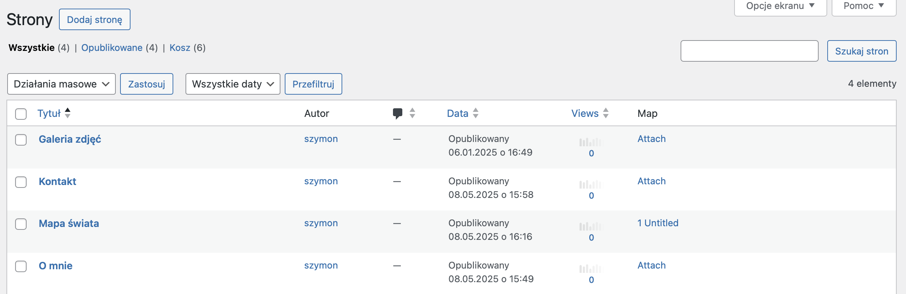
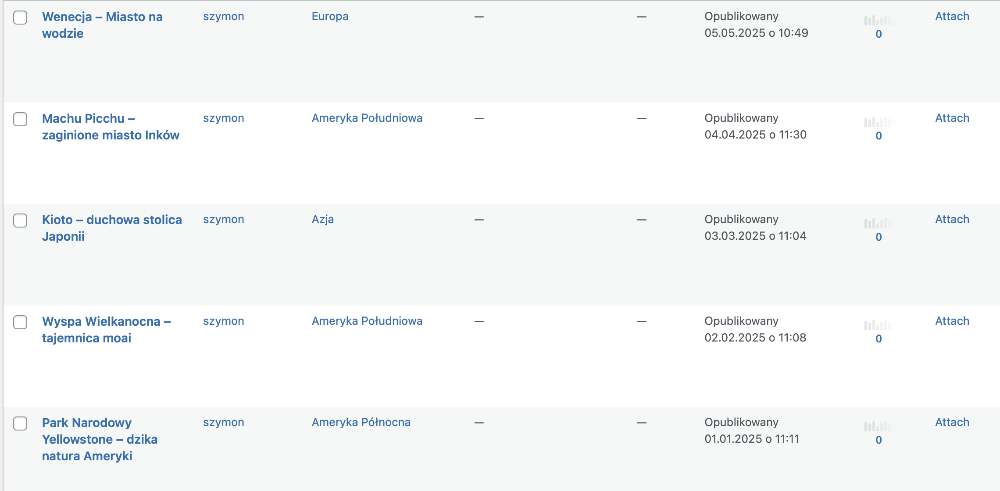
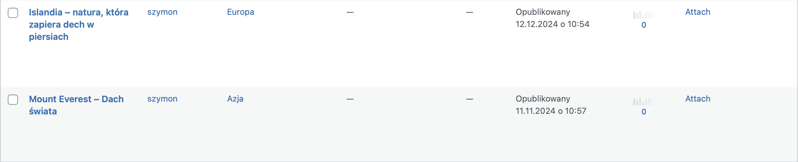
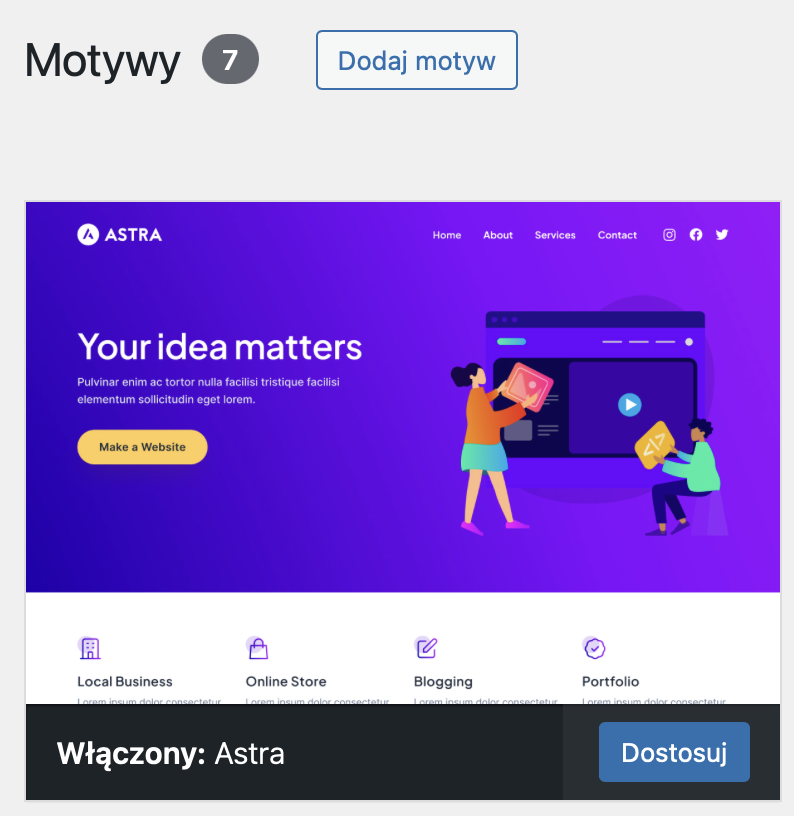
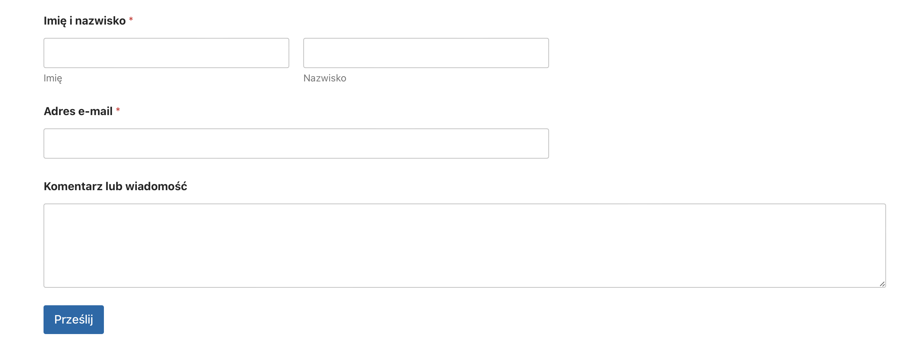
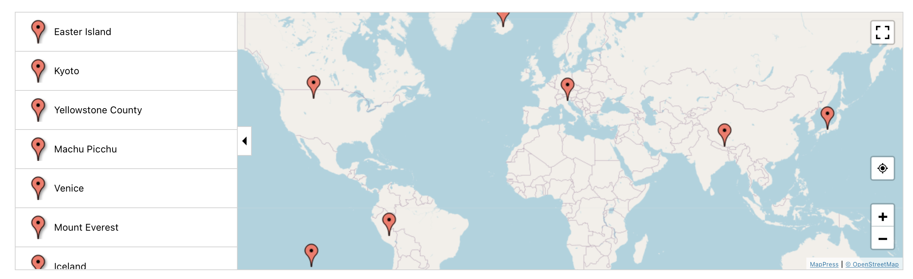
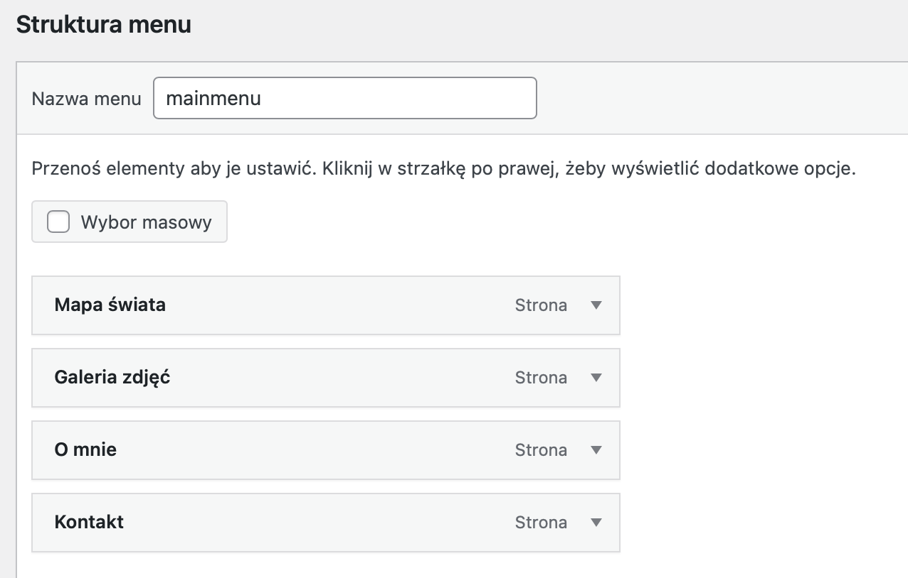
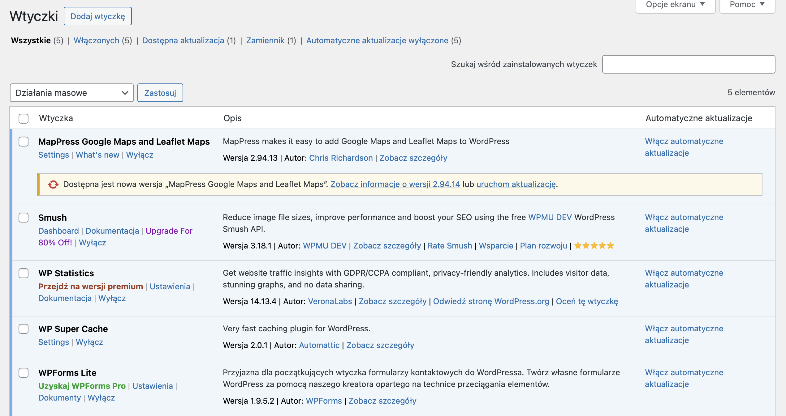
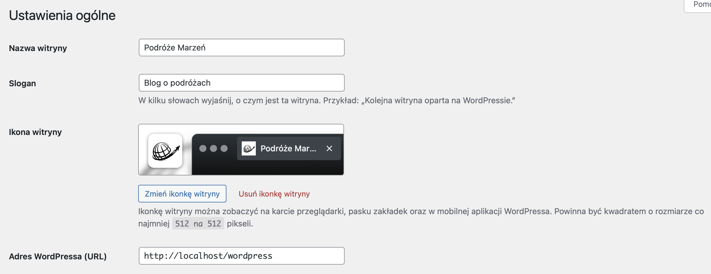

# Serwis ma zawierać co najmniej 11 podstron/wpisów utworzonych w różnych dniach w przeciągu ostatnich 6 miesięcy.

## Strony 

## Wpisy

# Wyszukaj i użyj ciekawy, najlepiej darmowy motyw.

# Użyj widgetów.

## Formularz kontaktowy

## Mapa

# Użyj menu, w którym będą odnośniki do stron statycznych.

# Użyj co najmniej 5 różnych wtyczek.

# Dostosuj ustawienia.

## Przykład zmienionych ustawień głównych

